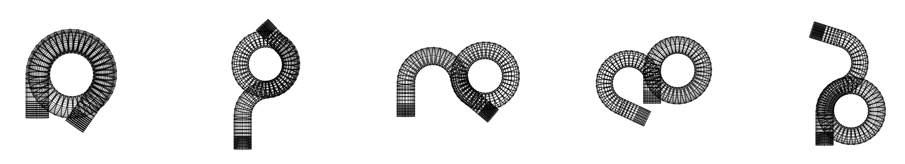

<a>

</a>

# ML-Assisted Flow Reactor Design

[](https://github.com/psf/black) [](https://opensource.org/licenses/MIT) 


## Outline

```pulsed_flow_helical_tube``` contains the code to optimise helical-tube reactor geometry and operating conditions.

```mesh_generation``` contains mesh generation code. Helical tube reactors are meshed in Python using [```classy_blocks```](https://github.com/damogranlabs/classy_blocks). Meshes are generated based on parameterisation variables, as well as fidelities. 

```parameterisation_study``` contains the code relating to the optimisation of coil cross-section and path.

## Instructions for Simulated Chemical Reactors

- Install the classy_blocks library as a submodule in the mesh_generation folder
```
$ cd mesh_generation
$ git submodule add git@github.com:damogranlabs/classy_blocks.git
```

- Create and activate the Anaconda environment
```
$ conda env create -f environment.yml
$ conda activate mf_design_env
```

### Requirements
- Strongly advise using Linux.
- OpenFOAM V1906
- Anaconda
- [Swak4FOAM download](https://openfoamwiki.net/index.php/Installation/swak4Foam/Downloading) (development version)
- [Swak4FOAM install](https://openfoamwiki.net/index.php/Installation/swak4Foam)
